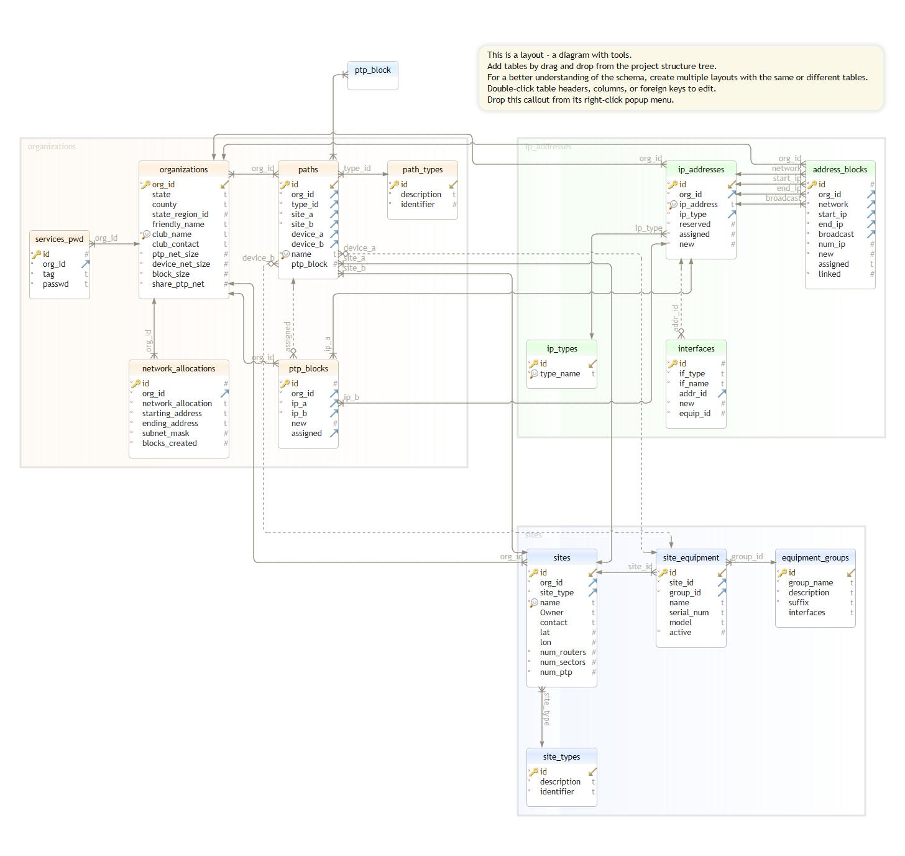
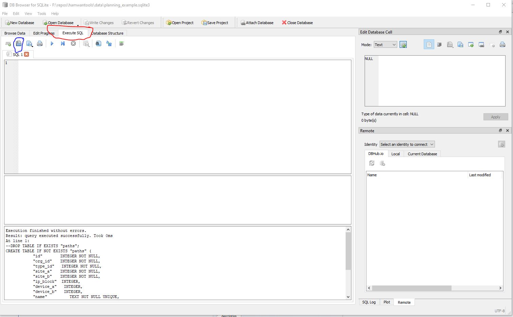
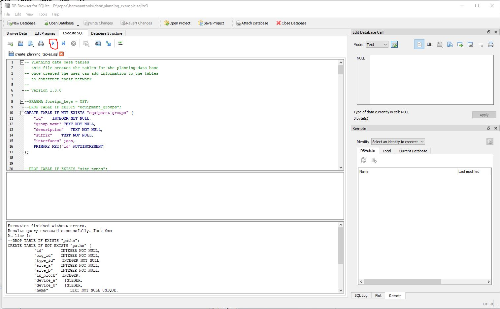

# Database and Other Tools
## Introduction
As stated in the planning document it is important to document your network. Again there are 
a several way to do this, and you should use a method that you are conformable with. Because of the complexity
of networks, and the multiple pieces of information that needs to be tracked, I have chosen
to use a SQLite Database. The key reasons for using a DB are:
    - Able to add and link data items in small chunks
    - Able to develop queries and tools for adding items reducing manual error
    - Able to build tools to 'map' the network
    - Able to build tools to generate configuration file for devices
    - Able to easily add new devices and configuration parameters to the network
    - SQLite is supported on Windows, linux and Mac platforms.
    - Database is a file, which can be shared

For tool development I have chosen to use Python3. Python3 is supported by Windows, linux and Mac,
is object-oriented, and well documented and supported.

Another major technology use is JSON. YAML was considered, but SQLite support or YAML is not available
at the time of writing.

### Installing SQLite
To install SQLite on your platform, use your favorite search engine and search for 'install sqlite on "platform"'.
Here is a list of sites I used to install/verify SQLite  
 - [macOS](https://flaviocopes.com/sqlite-how-to-install/)
 - [Windows](https://www.sqlitetutorial.net/download-install-sqlite/)
 - [Ubuntu Linux](https://www.digitalocean.com/community/tutorials/how-to-install-and-use-sqlite-on-ubuntu-20-04)

You can also find sqlite downloads at [SQLite]{https://www.sqlite.org/download.html)

In addition to SQLite, you may want to donwload 
[sqlite tool](https://www.sqlitetutorial.net/download-install-sqlite/#:~:text=The%20SQLiteStudio%20tool%20is%20a,CSV%2C%20XML%2C%20and%20JSON.)
and [DB Browser](https://sqlitebrowser.org/dl/)

We use DB Browser for sql queries.

### Installing Python
To install SQLite on your platform, use your favorite search engine and search for 
'install python on <platform>'.
Here are a list of sites I used for installing Python:  
 - [macOS](https://docs.python-guide.org/starting/install3/osx/)
 - [Windows](https://www.howtogeek.com/197947/how-to-install-python-on-windows/)
 - [Ubuntu Linux](https://www.how2shout.com/linux/how-to-install-python-3-and-pip-3-on-ubuntu-20-04-lts/)

### Other requirements
For additional requirements please see the [ReadMe](../README.md)

## Database Design
In our discussion [Planning Your Network](./PlanningYourNetwork.md) we talked about sites, equipment 
and path (primarily backbone PTP paths). We also talked about getting a block of addresses for
your network, and creating an organization to build and control the site. Each of these translates
into a database table, with additional tables for address blocks and ptp blocks and ip_addresses.

### DB Schema

### Creating the DB, adding tables and  types

### Creating 
 1) open DB Browser
 2) Select New Database
 3) Charge to the directory where you want the DB stored (../hamwantools/data)
 4) Enter the file name and use the .sqlite3 suffix
 5) Click Save

#### Adding Tables
 1) open DB Browser
 2) Open your database 
 3) Select the Execute SQL tab (red) and select the open file (blue)

 4) Select the ../query/create_planning_tables.sql
 5) Click the run button 

#### Add type information
 1) open DB Browser
 2) Open your database 
 3) Select the Execute SQL tab and select the open file
 4) Select the ../query/add_types.sql
 5) Click the run button

### Add Organization
 1) open the ./queries/add_org.sql in DB Browser Execute SQL window
 2) Edit the file for your organization
 3) Click the run button

### add Security information
 1) open the ./queries/add_service_keys.sql in DB Browser Execute SQL window
 2) Edit the key_val values for your organization
 3) Click the run button

### Adding your Sites
To add sites, we are going to use the tool add_sites.py (./tools/add_sites.py). In our 
[Planning Your Network](./PlanningYourNetwork.md) discussion, we created a list of sites.
Out tool allows use a .csv file to enter multiple sites (see [equipment_example](../examples/site_example.csv))

Before running the tool, use the ../examples/site_example.csv as a template to create your
information. Once done editing the template, run the tool to add your sites.  
Example: python ./tools/add_sites.py -c example_club --csv ./examples/site_example.csv --db ./data/planning_example.sqlite3

### Adding your paths

Example:  python ./tools/add_paths.py -c example_club --csv ./examples/path_example.csv --db ./data/planning_example.sqlite3

### Add Equipment to sites

Example: python ./tools/add_equipment.py -c example_club --csv ./examples/equipment_example.csv --db ./data/planning_example.sqlite3

### Add Equipment to Paths

Example:python ./tools/add_equipment2path.py -c example_club --db ./data/planning_example.sqlite3

### Add your Interfaces

Example:python ./tools/add_interfaces.py -c example_club --db ./data/planning_example.sqlite3

### Add network allocation

### Add IP Address allocation

