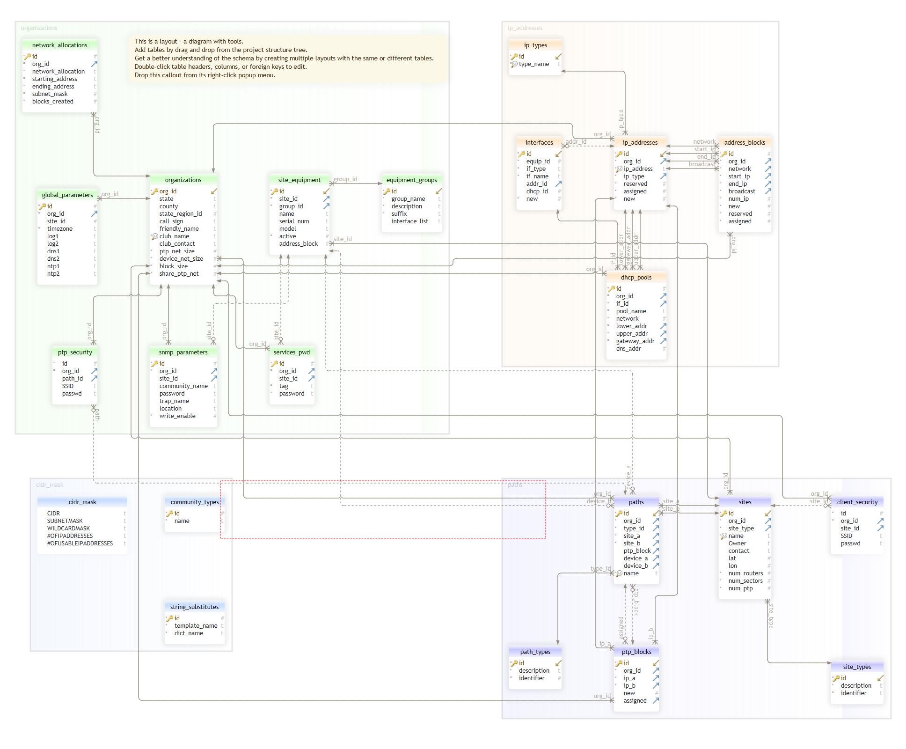

# Database and Other Tools
## Introduction
As stated in the planning document it is important to document your network. Again there are 
a several way to do this, and you should use a method that you are conformable with. Because of the complexity
of networks, and the multiple pieces of information that needs to be tracked, I have chosen
to use a SQLite Database. The key reasons for using a DB are:
    - After initial load it is easy to maintain
    - Able to add and link data items to configuration parameters
    - Able to develop queries and tools for getting configuration parameters reducing manual error
    - Able to develop queries and tools for adding, deleting and moving data items
    - Able to build tools to generate configuration file for devices
    - Able to easily add new devices and configuration parameters to the network
    - Able to build tools to 'map' the network
    - SQLite is supported on Windows, linux and Mac platforms.
    - Database is a file, which can be shared and made profitable

For tool development I have chosen to use Python3. Python3 is supported by Windows, linux and Mac,
is object-oriented, and well documented and supported.

Another major technology use is JSON. YAML was considered, but SQLite support or YAML is not available
at the time of writing.

### Installing SQLite
To install SQLite on your platform, use your favorite search engine and search for 'install sqlite on "platform"'.
Here is a list of sites I used to install/verify SQLite  
 - [macOS](https://flaviocopes.com/sqlite-how-to-install/)
 - [Windows](https://www.sqlitetutorial.net/download-install-sqlite/)
 - [Ubuntu Linux](https://www.digitalocean.com/community/tutorials/how-to-install-and-use-sqlite-on-ubuntu-20-04)

You can also find sqlite downloads at [SQLite]{https://www.sqlite.org/download.html)

In addition to SQLite, you may want to donwload 
[sqlite tool](https://www.sqlitetutorial.net/download-install-sqlite/#:~:text=The%20SQLiteStudio%20tool%20is%20a,CSV%2C%20XML%2C%20and%20JSON.)
and [DB Browser](https://sqlitebrowser.org/dl/)

We use DB Browser for sql queries.

### Installing Python
To install SQLite on your platform, use your favorite search engine and search for 
'install python on <platform>'.
Here are a list of sites I used for installing Python:  
 - [macOS](https://docs.python-guide.org/starting/install3/osx/)
 - [Windows](https://www.howtogeek.com/197947/how-to-install-python-on-windows/)
 - [Ubuntu Linux](https://www.how2shout.com/linux/how-to-install-python-3-and-pip-3-on-ubuntu-20-04-lts/)

### Other requirements
For additional requirements please see the [ReadMe](../README.md)

## Database Design
In our discussion [Planning Your Network](./PlanningYourNetwork.md) we talked about sites, equipment 
and path (primarily backbone PTP paths). We also talked about getting a block of addresses for
your network, and creating an organization to build and control the site. Each of these translates
into a database table, with additional tables for address blocks and ptp blocks and ip_addresses.

As we build out the DB, python tools were written to build out tables. For example on site equipment,
the input is a CSV file, but we do not require the equipment name. Instead, the tools automatically
build the name for you. 

### DB Schema
The following is an image of the DB schema:

TBD - add description of tables

## Creating the DB, adding tables and  types

### Creating 
 1) open DB Browser
 2) Select New Database
 3) Charge to the directory where you want the DB stored (../hamwantools/data)
 4) Enter the file name and use the .sqlite3 suffix
 5) Click Save

#### Adding Tables
 1) open DB Browser
 2) Open your database 
 3) Select the Execute SQL tab (red) and select the open file (blue)

 4) Select the ../query/create_planning_tables.sql
 5) Click the run button 

#### Adding cdir table
CIDR stands for Classlesss Inter-Domain Routing. It enables network administrators to group 
blocks of IP addresses into single routing networks. We are always needing to reference this 
information for deciding our IP address space for the sites. This table is provided as a reference.

CIDR accomplishes the same task as traditional subnet masking

This table is provided as a support tool for looking up CIDR value

 1) open DB Browser
 2) Open your database 
 3) select File -> Import
 4) select the file ./examples/cidr_mask.csv
 5) click Ok

#### Add type information for Sites, Equipment, Interfaces, ...
To help identify different site types, devices, interfaces and address groups we use the 
concept of 'types'. This 'type' information is defined in a type table. Basically a type has a 
unique id, and a tag value (e.g. router, sector, bptp, etc. for equipment). A foreign key is then added to 
the tables, using the unique id, to identify the type.

 1) open DB Browser
 2) Open your database 
 3) Select the Execute SQL tab and select the open file
 4) Select the ../query/add_types.sql
 5) Click the run button

##### Community Types
SNMP Communities are like *passwords*, allowing SNMP Agents to vet polling from SNMP Collectors in
a crude way. More modern versions of SNMP add authentication and encryption to the protocol.

The default Community string on almost all network devices is simply the word "public". 
This is well-known, and many port scanners like Nmap will automatically try the default "public" 
string. If the default Community string is left in place it can allow attackers to perform 
reconnaissance quickly and easily. 

On MikroTik platforms it's not possible to delete or disable the default "public" 
Community string, but it can be renamed and restricted:  

&nbsp;&nbsp;&nbsp;&nbsp;&nbsp;&nbsp;/snmp community set 0 name=not_public read-access=no write-access=no

Mikrotik provides three types of community:
 1. public: community is available to the public
 2. private: A private community
 3. trap: receives trap notification from devices

##### Equipment Groups
We have various pieces of equipment that we use in our network, such as site routers, sector routers,
backbone PTP (bptp), etc. Each of these devices have different configuration requirements, and different
interfaces. For a site router (router) has multiple wired ether_ip interfaces and no wireless interfaces.
While a bptp device ahs a single ether_ip, and one wireless connection.

The equipment_groups table defined te equipment in our system, the naming suffix and device 
interfaces.

##### IP Types
We have three different IP address types:
 1. pool - address is assigned to a general address block pool, for use by a piece of equipment  
Used primarily by site routers and sector routers
 2. ptp - an address used in a ptp connection. Note these addresses need tobe paired and equidistant apart.
 3. device - an addresses associated with a virtual device like ospf router.

##### Site Types
We currently have three site types:
    1. cell - this is a general site with sector, bptp, and cptp devices
    2. gateway - this is a cell site with connection to an ISP provider
    3. Client - a connection to a client

### Add Organization
All sites, paths and equipment are associated with an Organization, and the organization is responsible
for the installation, maintenance and disposal of the equipment assigned to the organization.

 1) open the ./queries/add_org.sql in DB Browser Execute SQL window
 2) Edit the file for your organization
 3) Click the run button

Note typically there is only one organization in a database; however we allow multiple 
organizations in the database. 

### Adding your Sites
In the [Planning Your Network](./PlanningYourNetwork.md) discussion, we created a list of sites in a csv file. 
We will now use this 'csv' file to add the sites to the DB, using the tool add_sites.py (./tools/add_sites.py). In our 
(see [equipment_example](../examples/site_example.csv))

Before running the tool, use the ../examples/site_example.csv as a template to create your
information. Once done editing the template, run the tool to add your sites.  

Example: python ./tools/add_sites.py -c example_club --csv ./examples/site_example.csv --db ./data/planning_example.sqlite3

### Adding your Backbone PTP paths
Next we want to add our backbone path information (BPTP). In our 
[Planning Your Network](./PlanningYourNetwork.md) discussion, we created a list of paths in a csv file.
We will now use that 'csv' file to add our paths to the DB

Before running the tool, use the ../examples/path_example.csv as a template to create your
information. Once done editing the template, run the tool to add your paths. 

Example:  python ./tools/add_paths.py -c example_club --csv ./examples/path_example.csv --db ./data/planning_example.sqlite3

### Add Security information
There are several 'keys' that are required to allow the various routers and switches
to interconnect, while keeping rouge device out. In addition, we need to understand the attack surface
so we can protect the network for bad actors. The problem we will face is, how do we provide adequate
security, without increasing our management complexity to a point where our network is not
maintainable? 
There are certain items that we want to keep common network wide, such as the Sector SSIDs and passwords,
since these will be used by clients, while we may want to supply separate for sites and paths. We also may want to 
separate information by service, such as SNMP. 
Because of this we have designed the database to accept security information for organization, site, 
path and snmp service, with the rule that lowest level security parameters tak presence.

By leaving the 'site' or 'path' number blank, defines a default set of keys that are applied network
wide. If a site or path id is provided, then the site keys will override the default keys.

 1) open the ./queries/add_service_keys.sql in DB Browser Execute SQL window
 2) Edit the key_val values for your organization
 3) Click the run button

### Add Global Parameters
General parameters can be applied to the network or site level of the network. These parameters
include but are not limited to:
 - logging
 - dns
 - ntp
 - time zone

If parameters re entered with a site_id, they are site specific parameters. While if the site_id
is left empty (NULL) they are network parameters. If there are no global site parameters, the network
parameters will be used.

TBD instructions for loading example network global parameters

### Add Equipment to sites

Example: python ./tools/add_equipment.py -c example_club --csv ./examples/equipment_example.csv --db ./data/planning_example.sqlite3

### Add Equipment to Paths

Example:python ./tools/add_equipment2path.py -c example_club --db ./data/planning_example.sqlite3

### Add your Interfaces

Example:python ./tools/add_interfaces.py -c example_club --db ./data/planning_example.sqlite3

### Add network allocation
 use add_netaloc.sql
### Construction your allocation and ptp blocks

Example:python ./tools/add_ipaddresses.py -c example_club --db ./data/planning_example.sqlite3

### Add Equipment to the Paths

Example:python ./tools/add_equipment2path.py -c spokane --db ./data/spokane_example.sqlite3

### Add Interfaces

Example:python ./tools/assign_ip2interfaces.py -c spokane --db ./data/spokane_example.sqlite3

### Assign IP Address to Interfaces

Example: python ./tools/assign_ip2interfaces.py -c spokane --db ./data/spokane_example.sqlite3 

