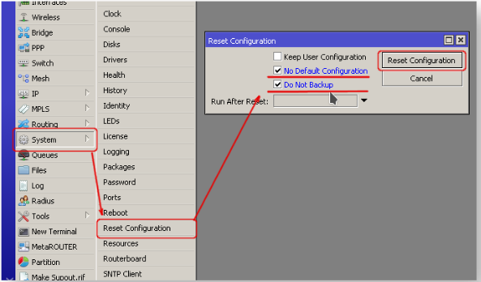
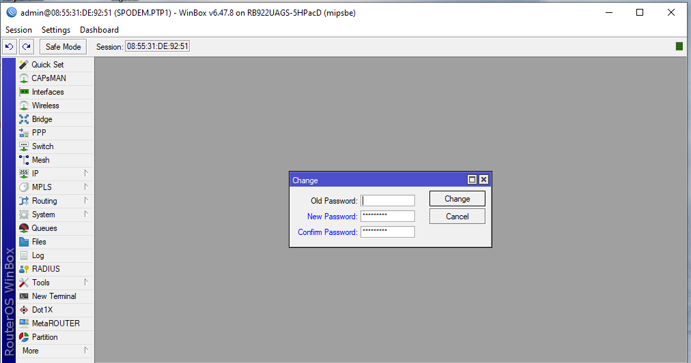

First Time Setup
================

The first time setup will vary dependent on the device being set up. Read the setup 
guide provided with the device for additional instructions.

## Connecting to the Router

There are two types of routers:

With default configuration
Without default configuration. When no specific configuration is found, IP address 
192.168.88.1/24 is set on ether1 or combo1, or sfp1.
More information about the current default configuration can be found in the Quick 
Guide document that came with your device. The quick guide document will include 
information about which ports should be used to connect for the first time and how 
to plug in your devices.

This document describes how to set up the device from the ground up, so we will ask 
you to clear away all defaults.

When connecting the first time to the router with the default username admin and no 
password, you will be asked to reset or keep the default configuration (even if the 
default config has only an IP address). Since this article assumes that there is no 
configuration on the router you should remove it by pressing "r" on the keyboard when 
prompted or click on the "Remove configuration" button in WinBox.

Note most of the Mikrotik devices we use, come with no default configuration and 
require Winbox to configure the device. You can download winbox from [here](https://mikrotik.com/download)
You will also need to know the MAC address for the device.

## Names
Names are more for human use than 'system' use, and there are names for the system, interfaces, 
routes, rules, etc. As a convention, System Names are name given to the physical device, and consist 
of two parts: location and function. For example; if the device is the first PTP device in the cell, 
in the Krell cell, it will be name 'KRELL.PTP1', if it is the first sector at Krell, it's name would be KREL.S1, 
etc. This allows us to find the physical device. 

To configure the device, we need to use an IP address assigned to the device. as a best pratice
it is advised that you make a lable containing the system name and IP address, for the device.

## Reset the Router
The first thing to do is to reset the router. Using winbox, connect to the router, using the MAC address.
and do System->Reset Configuration, check the boxes "No Default Configuration" and
"Do Not Backup", then click "Reset Configuration".

The reset will cause the system to reboot. Wait for abut 15 second, the reconnect to the device.

You can also reset the router from the command line. Open a terminal and enter the following
    '/system reset-configuration no-defaults=yes skip-backup=yes'

### Set Admin Password
 1. Select System->Password
 2. Enter Password
 3. Click OK

Note: once the password is set, you will need to use it access the device

4. reboot device.

At this point you can now use the config tool to complete the device setup.

After the reboot reconnect to the device

### Download config file
    1. Reconnect to the device using winbox.exe
    2. Select the 'File Button'
    3. On the local machine go to the project output files
    4. Right click on the file for your device and drig it into the files box on winbox.exe. This uploads the file
    5. Open a terminal
        a. Enter the command /import <device file> Enter
    