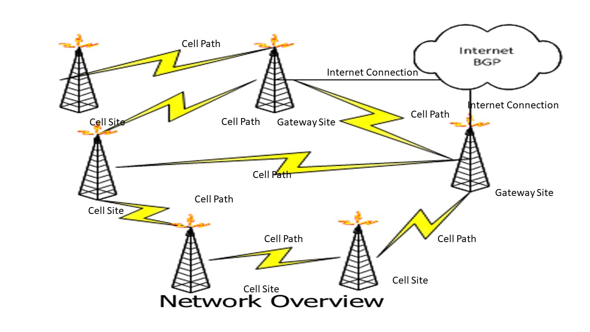
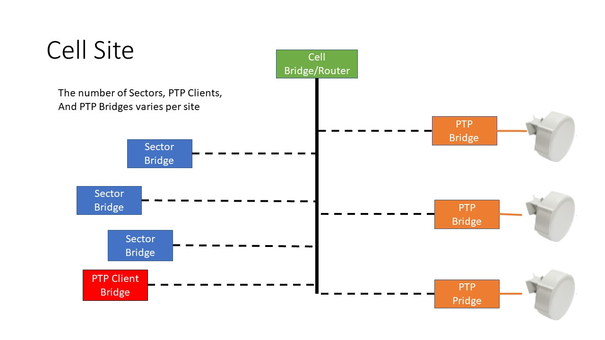
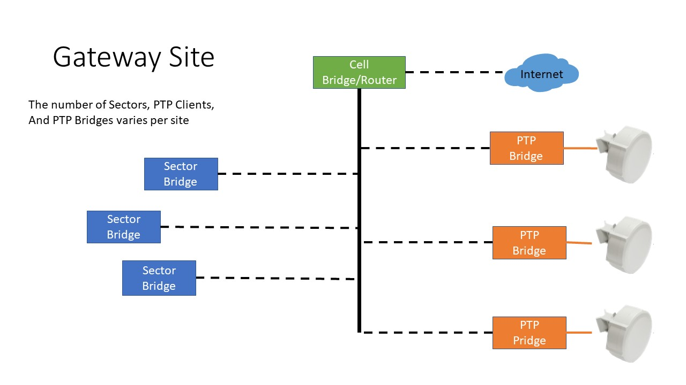

# Introduction to HamWAN

HamWAN is a modern, multi-megabit, IP-based, digital network for amateur radio use!

HamWAN is also a non-profit organization developing best practices for high speed amateur 
radio data networks and runs the Puget Sound Data Ring in Washington State as 
a real-world network implementation of their proposed designs.

The HamWAN Data Ring has cells deployed at numerous wide-coverage sites. These sites 
are interconnected with radio modems and routed with Open Shortest Path First (known 
by the acronym OSPF). This forms a redundant high-speed backbone to route traffic 
between sites and to the internet.

Each Cell Site consist of equipment to connect Clients with the backbone and 
thus the internet, through a Gateway Site. Connections to a Client, can be done through
a radio modem. The radio frequencies used by the backbone network are different that those 
used for client connections, to prevent interference. Also, Client connections use frequencies 
allocated to amateur radio (HAMs). While Backbone connections do not.

Essentially HamWAN is a WISP (Wireless Internet Service Provider) with a class A network address
space, that will share that address space with licensed Ham Radio Clubs.

## Allocating addresses to subnets
How you allocate IP addresses will depend on the number of addresses you receive. Traditionally, a 2048 block
(8 class C networks) is assigned to a club. One group of 256 addresses (one (1) class 'C' network) is 
allocated for PTP Backbone, and is broken down into /31 networks of 2 adjacent IP addresses.
Another group of 256 addresses routing interface IPs. The remaining address are then divided into blocks of
sixteen (16) addresses each and are reserved for the site switch and sector equipment, with each switch getting one block,
and each sector getting 2 blocks.  

You want to allocate more blocks to those sites which have more clients.

### Minimum number of PTP addresses
PTP networks use /31 networks which is one pair of adjacent IP addresses (one for each end
of the PTP link). We currently allocate 256 addresses for P2P, allowing for 128 connections.
If the number of P2P connections are less than 64, then you only need 128 address, and the 
site routers and P2P wlan can share a 256 network address space.

## OSPF Routing
Each OSPF router passes along information about the routes and costs they’ve heard about to all of their 
adjacent OSPF routers, called neighbors.

OSPF routers rely on cost to compute the shortest path through the network between themselves and a remote 
router or network destination. The shortest path computation is done using Djikstra’s algorithm. This 
algorithm isn’t unique to OSPF. Rather, it’s a mathematical algorithm that happens to have an obvious 
application to networking.

Each subnet is connected to other subnets via an ospf router.

Another important idea in OSPF is that interfaces used to exchange information with OSPF neighbors have different types. There are too many types to discuss here but you should be aware of two important ones.

AnOSPF broadcast interface is connected to a shared network, like Ethernet.

AnOSPF point-to-point interface is connected to a link where there can only be a single OSPF router on 
either end, such as a WAN link or a purpose-built Ethernet link.
The reason for the various interface types is to make sure that all routers know about all routes from all 
other routers.

On point-to-point links, there’s no mystery — the two routers know they’re the only OSPF routers on the 
link, and so they exchange routes with each other.

On broadcast links, there’s a potential for many different OSPF routers to be on the network segment. 
To minimize the number of neighbor relationships that form on broadcast links, OSPF elects a designated 
router (as well as a backup) whose job it is to neighbor with all other OSPF routers on the segment and 
share everyone’s routes with everyone else.

# Selecting Equipment
