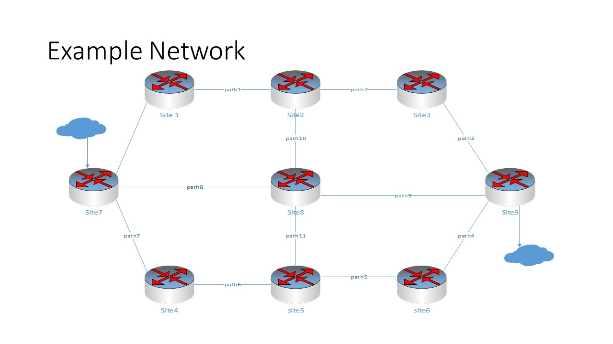

# Introduction to HamWAN

HamWAN is a modern, multi-megabit, IP-based, digital network for amateur radio use!

HamWAN is a non-profit organization developing best practices for high speed amateur 
radio data networks. HamWAN also runs the Puget Sound Data Ring in Washington State as 
a real-world network implementation of their proposed designs.

The HamWAN Data Ring has cells deployed at numerous wide-coverage sites. These sites 
are interconnected with radio modems and routed with Open Shortest Path First (known 
by the acronym OSPF). This forms a redundant high-speed backbone to route traffic 
between sites and to the internet.

Each Cell Site consist of equipment to connect Clients with the backbone and 
thus the internet, through a Gateway Site. Connections to a Client, can be done through
a radio modem. The radio frequencies used by the backbone network are different that those 
used for client connections, to prevent interference. Also, Client connections use frequencies 
allocated to amateur radio (HAMs). While Backbone connections do not.

# Planning your network
## Things to think about 
Before you start planning you network, you should probably get you house in order. 
HamWAN controls the allocation of IP addresses, so you will need to file a request
to HamWAN for IP addresses. Before you can do that, though, you will need to have a
legitimate and registered HAM club. 
Also, HamWAN uses managed networks devices. If cost were no object, we could build
the network using components form Cisco, UniFi and others. Right now the Puget Sound 
Data Ring is build on Mikrotik, which provides reasonable cost managed network device. 
But these devices are not anything like the routers you buy at Home Depot, Costco, 
Stables or other computer or office supply stores. And they are not as cheep either. 

So in addition to HAM operators with solid RF experience, you will need a source for 
funding, and people who know something about managed networks. 

Finally, unless your group is extremely wealthy, and can afford to buy your own sites,
yu will probably need to work out business relationships with site owners, to allow you 
to mount your HamWAN equipment at their site. So you might want to find your self a Ham
enthusiast who is also a lawyer. 

## Getting Started
*"An Idea without a plan is nothing more thant a dream." -Steven A Board*

### A brief diversion
Rather than having a technology, that is looking for a problem, let's turn 
it around al describe our problem.

So what is the problem(s) we are looking to solve? Let's assume for a moment we want to start our own ISP
Service, and we want to provide wireless access to cover a very large geographical area. 
So, how would we go about doing that, and how much would it cost?

Well we would start by first determining where our client locations are, and the various 
options we have to connect to our clients. If we choose a wireless technology, then we need to locate 'towers'
where our clients will have a clear line of site to our access points. Then connect our access points back to our 
'central' office. This is essentially what we are doing with HamWAN. 

Basically we have two technical problems to solve, where do we put the access points, and how do we 
connect the access points to our 'central' office.

### First Thing First
The first place to start is locate the clients we which to serve. For the Connect Washington
initiative, our clients are government organizations, like Police, Fire, Emergency Management, 
DOT, Parks and Rec, etc. and NGO like hospitals, clinics, shelters, Red Cross, etc. Our gosl
is not to provide high speed primary service to these agencies, but rather to provide emergency
network backup, and reliable low speed support for remote IoT devices and messaging.

So the first thing to determine is how many clients do we have, where are they located
and how may 'cells' do we need to cover the clients? 

#### Cell Planning
To estimate the cells needed, requires a more involved process. First you need to make a list of 
available cell sites with potential for good coverage. From that list you can trim it 
down too sites that are accessible and affordable. From there you need to make propagation 
maps to determine coverage and make sure all your clients are served. Finally: you need to 
select those sites which give you the most coverage for the least cost.

There is no magic formula or tool for selecting sites, and you need to rely on experience.
For the purpose of this article, that we have done all our do allegiance and determined that we
need eleven (9) sites to server 1100  clients.

### Connecting the Sites (The Backbone)
Once we have our cell sites located, the next step is to determine how the cell sites are
connected. It is best if a cell site is connected to at least two (2) other cells. Doing so
will provide a redundant path in case a site goes down. To improve performance of the backbone,
some sites will require more thant two (2) paths. It should be noted that if your client 
has a need for high reliability networking, they will need to have 'redundant clients' pointed
to multiple cell sites, and will need to be counted in the total number of clients. 
The needs for performance and reliability to be part of your site planning step above.
For our example we will have 11 paths,

### Access points 
In addition to the site to site connection we would like to have an 'omnidirectional' access
point. Typically, omnidirectional devices have poor performance when compared to directional 
device, and access points are no exception. To resolve this problem, a device known as a 'sector'
antenna is used. Sector antennas with various beam width, measured in degrees. The most common one
are 120 degree device, requiring three device to get 360 degree coverage.

### Gateways Site
Last but not least, we need to identify the sites that will connect us to the outside world.
These sites are call Gateway Sites. They are exactly the same as a regular site, with an additional
piece to connect the site to the internet using BGP routing.
For our example we will have two (2) gateway sites

### Diagram of our example network

### How many addresses do I need?
Every interface connected to the network requires an IP address. Well isn't the number of 
IP addresses needed the number of devices connected to the network? Nop, devices can have
multiple interfaces connected to the internet. Take for example your laptop, it has a wireless 
connection, and it may have a wired connection. 

We are assuming that each client connection is one (1) IP address, but we also need to add in 
the backbone devices (PTP connections) and sector devices. Finally, we need to add in the number
of 'site routers' (one per site). We can use the following formula to compute the number of
addresses needed:

$ nipA = nc + np2p\times 4 + ns\times 2 + n_sites $

where:
    nc is the number of clients
    np2p is the number of p2p connections
    ns is the total number of sectors
    n_sites is the number of sites. 

$ nipA = 1100 + 22*4 + 27*2 + 9 = 1100 +88 + 54 + 9 = 1251 $

When we request addresses we need to request  blocks that are powers of 2,
so we will request 2048 addresses.

### Keeping track of thing.
We could keep track of all this using a text editor or spreadsheets, but doing so leaves 
us open to errors, and requires manual reviews. As part of this project, we have created
tools that use a database to record the information we generate. 

For this part of the discussion, tools:
    - addOrganization.py
    - addSite.py
    - addPath.py
were used. 

## Allocating addresses
How you allocate IP addresses will depend on the number of addresses you receive. Traditionally, 
one (1) class 'C' network is allocated for PTP Backbone, and one (1) class 'C' for device 
ethernet interface IPs. The remaining address are then allocated out, equal size blocks of
powers of 2, to the sector routers and cell routers in (min of four (4) blocks per cell). 
Typically, blocks of sixteen (16) with a network mask of/28 are used. The allocation are 
made until all blocks are allocated. Using our example of 1024 addresses, with one (1) 
class 'C' for PTP and one (1) class 'C' (total 512 addresses) we would have 512 addresses 
left, giving us 32 blocks of 16 addresses. 

You want to allocate more blocks to those sites which have more clients.

### Minimum number of PTP addresses
PTP networks use /31 networks which is one pair of adjacent IP addresses (one for each end
of the PTP link). We currently allocate 256 addresses for P2P, allowing for 128 connections.
If the number of P2P connections are less than 64, then you only need 128 address, and the 
site routers and P2P wlan can share a 256 network address space.

# Selecting Equipment
