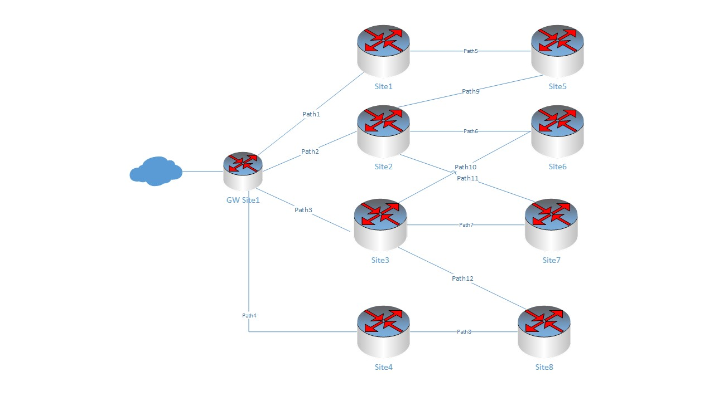
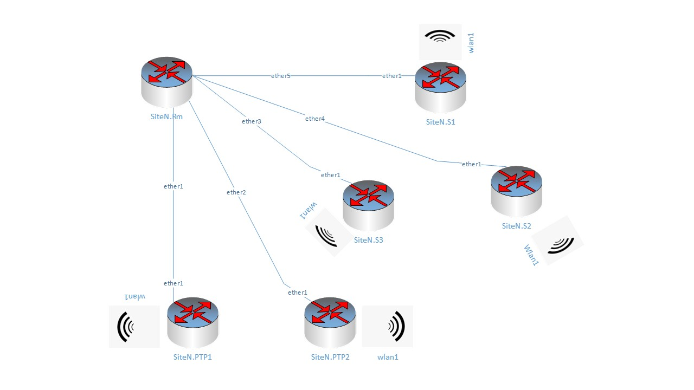

# Planning and Building a HamWAN network
## Things to think about 
Before we start planning building 'HamWAN'  network, we should probably get you house in order
and understand the rule. 

Basically we are building a Wireless Internet Service Provider (WISP). To do this we will need to 
make a lot of decisions on Site locations, frequencies, equipment to use, our gateway ISP providers, etc. The advantage of using
HamWAN as a model is that they have already figured out many of the pieces for us. and they have a route-able
address space that we can share. But even with all HamWAN design, equipment choices and recommendations, 
there are many decision we will have to make.

So in addition to Ham operators with solid RF experience, you will need a source for 
funding, and people who know something about managed networks, access to towers and buildings
for sites, time and patients, legal counsel, etc. So you might want to first  find the people 
around you who are willing to work with you on this project and form a group (a club), to work through the many
decisions and problems we will encounter.
### HamWAN address Space and Equipment Choices
HamWAN controls the allocation of IP addresses, so you will need to file a request
to HamWAN for IP addresses. Before you can do that, though, you will need to have a
legitimate and registered HAM club, with a call sign. we will want ths to b a legal entity
to limit hte liability of the group members. 

Also, HamWAN uses managed networks devices. If cost were no object, we could build
the network using components form Cisco, UniFi and others. Right now the Puget Sound 
Data Ring is build on Mikrotik, which provides reasonable cost managed network device. 
But these devices are not anything like the routers you buy at Home Depot, Costco, 
Stables or other computer or office supply stores. Also, they do not have the training, and support
like Cisco, Unifi and Big 5. Thus, you may require additional training to support and understand these devices.
So, be prepared to spend time online viewing videos and reading documents.
### Financing your network
In most ham based projects, capital funding is handled by the team putting it together, and operational
cost is ignored. However, for this project you will need to think of both capital funding (money to buy all the equipment
and install it) but also ongoing operating cost (tower rental, equipment failure, etc.). 
Unless your group is extremely wealthy, and can afford to buy and maintain your own sites, equipment,
ISP services, you will probably need to work out business relationships with site owners, to allow you 
to mount your HamWAN equipment at their site and pay regular fees to maintain access. You will
also need to draw up contracts, and other legal documents.
### Other Issues
Other rules we need to be careful about are rules for ham band usage. If we use Ham frequencies,
we must first be licensed Ham's,cannot use encryption or secure links or other common network tools to protect te user
and keep a record of activities. Like many things, we do not discuss every technical, legal, financial,
etc., issue we may encounter. but the group building out the network will need to address.
### Documenting what you do.
As you begin to pt your network together, you are going to hit a documentation problem. There are several option for
documenting you network. Some people use Microsoft Word, others use Excel, etc. You need to choose a 
documentation method that allows tou to track great details, add, delete, move and change devices.
For our example project we have created a database that till track our activity. Python scripts have
been created to add, remove and edit entries. You do not have to use these tools. What is most importat
is collecting the information and documenting it so someone can configure a device.
### Naming Conventions
HamWAN has names for everything. Using Names we are able to identify sites, equipment types, and paths.
By tradition, HamWAN uses a doted naming convention for naming equipment and paths. For equipment,
 the convention is the:  
    site name.function#  
For path names the convention is:  
    to site.from site

It is best to not have spaces or special characters, except '_', in names. Also names must be unique 
within the network. Also, it is recommended that Names be in all upper or all lower case. When Names
are compared, only exact matches are case-sensitive.
## Getting Started
*"An Idea without a plan is nothing more thant a dream." -Steven A Board*
### A brief diversion
Rather than having a technology, that is looking for a problem, let's turn 
it around al describe our problem and figure out how technology can solve it.

So what is the problem(s) we are looking to solve? Are we building a network where Ham operators get free internet?
Are we building a low cost network for emergency preparedness? Are we providing a service for one or more
served agencies?

For our example lets assume we are setting up a redundant WISP for our served agencies and provide low cost
SCADA transport for critical services:
 1) Fire
 2) Department of Transportation
 3) Sherif
 4) major Hospitals
 5) Stream Flow data
 6) Seismic Data

Other thant SCADA data the network is not a primary provider,  but will be used by the served
agencies, for network services, when primary network services are down.

We want a service that provide wireless access to cover a very large geographical area. We are willing
to give up high speed data  for cost, and it is important to the served agencies, that the group running the 
network make the network a priority, and that equipment can be added and removed from the network easily.

What do we need to do to build out to design and build this network?

Well we would start by first determining where our client locations are, and the various 
options we have to connect to our clients. If we choose a wireless technology, then we need to locate 'towers'
where our clients will have a clear line of site to our access points. Then connect our access points back to our 
'gateways'. This is essentially what we are doing with HamWAN. 

#### Site Planning
There are three types of sites we need to plan for, Gateway, Cell and Client. Client sites are the easiest, 
they are located at the Clients Location, and connect to the Clients infrastructure.

Gateway and Cell Sites are simular, with Gateways requiring additional equipment to connect the site to an ISP.
Usually, Gateway sites are at a served agency and act as both a Gateway and Client Site.

Cell Sites are used to access by the clients and link them to the Gateway and other Clients. 

To estimate the number of cell site needed, requires a more involved process. First you need to make a list of 
available cell sites with potential for good coverage. From that list you can trim it 
down too sites that are accessible and affordable. From there you need to make propagation 
maps to determine coverage and make sure all your clients are served. Finally: you need to 
select those sites which give you the most coverage for the least cost.

There is no magic formula or tool for selecting sites, and you need to rely on experience, and your understanding of 
microwave propagation.

### Connecting the Cell Sites (The Backbone)
Once we have our cell sites located, the next step is to determine how the cell sites are
connected. It is best if a cell site is connected to at least two (2) other cells. Doing so
will provide a redundant path in case a site goes down. To improve performance of the backbone,
some sites will require more thant two (2) paths. It should be noted that if your client 
has a need for high reliability networking, they will also need to have 'redundant clients' pointed
to multiple cell sites, and these redundant connections will need to be counted in the total number of clients, and
will affect the section of cell sites.
The needs for performance and reliability should be part of your site planning step above.

### Access points 
In addition to the site location to site connection we would like to have an 'omnidirectional' Point to Multipoint (PTMP) access
point. Typically, omnidirectional devices have poor performance when compared to directional 
device, and access points are no exception. To resolve this problem, a device known as a 'sector'
antenna is used. Sector antennas with various beam width, measured in degrees. The most common one
are 120 degree device, requiring three device to get 360 degree coverage. If all your clients are within a 120 degree
window, then you will only need a single sector.

Typically, Sector one (1) points North, Sector two (2) South East, and Sector three (3) South West.

### Gateways Site
Last but not least, we need to identify the sites that will connect us to the outside world.
These sites are call Gateway Sites. They are exactly the same as a cell site, with an additional
piece of equipment to connect the site to and ISP. Usually this equipment is supplied by the ISP.

### Getting Started
Let's assume that we have done the work and identified the number of clients, where they are located, and
the initial site studies, etc. And determined we need one Gateway, and have 200 clients. To get the coverage we need,
we will need to use eight (8) Cell Sites to connect up all the Clients using wireless PTMP connections. 
We also determine that four (4) of the Cell Sites are directly connect to Gateway site though PTP connections,
and each of the remaining 4 Sites will use a wireless PTP connection  to connect to one
of the Sites directly connected to the Gateway. 

.

Please note that we do not show client connections, and this is a simple network, with no redundancy. This is done to keep things simple,
so we can focus on the steps. Most likely in your network, you will have multiple Gateway sites and redundant paths to handle
the loss of a cell or gateway site, and if you can afford it, you might have redundant equipment on your sites.

#### Sites and Paths
##### Sites
| name  | site_type | owner | contact | lat | lon |
|-------|-----------|-------|---------|-----|-----|
| GW    | gateway   |       |         |     |     |
| SITE1 | cell      |       |         |     |     |
| SITE2 | cell      |       |         |     |     |
| SITE3 | cell      |       |         |     |     |
| SITE4 | cell      |       |         |     |     |
| SITE5 | cell      |       |         |     |     |
| SITE6 | cell      |       |         |     |     |
| SITE7 | cell      |       |         |     |     |
| SITE8 | cell      |       |         |     |     |

##### Paths
| name  | site_a | site_b | type_id |
|-------|--------|--------|---------|
| path1 | GW     | SITE1  | BPTP    |
| path2 | GW     | SITE2  | BPTP    |
| path3 | GW     | SITE3  | BPTP    |
| path4 | GW     | SITE4  | BPTP    |
| path5 | SITE1  | SITE5  | BPTP    |
| path6 | SITE2  | SITE6  | BPTP    |
| path7 | SITE3  | SITE7  | BPTP    |
| path8 | SITE4  | SITE8  | BPTP    |

BPTP - Backbone Point To Point: There are two type of PTP paths Client PTP (CPTP) and Backbone PTP (BPTP).
These paths use different frequencies (Bands) to prevent interference, even though they may use the same equipment.
### How many addresses do I need?
Every interface connected to the network requires an IP address. Well isn't the number of 
IP addresses needed the number of devices connected to the network? Nop, devices can have
multiple interfaces connected to the internet. Take for example your laptop, it has a wireless 
connection, and it may have a wired connection. 

We are assuming that each client connection is one (1) IP address, but we also need to add in 
the backbone devices (PTP connections) and sector devices. Finally, we need to add in the number
of 'site routers' (one per site). We can use the following formula to compute the number of
addresses needed:

$ nipA = nc + np2p\times 4 + ns\times 2 + n_sites $

where:
    nc is the number of clients
    np2p is the number of p2p connections
    ns is the total number of sectors
    n_sites is the number of sites. 

$ nipA = 200 + 8*4 + 24*2 + 9 = 200 +32 + 48 + 9 = 1251 $

When we request addresses we need to request  blocks that are powers of 2,
so our minimum size is 256, and we should ask for at least 512. In our example 
we will assume we asked for 1024 addresses

#### Document what we have
At this time we should have the following information:
 1) And Organization or Club, with a charted
 2) Identified Gateways, Cell Sites and Clients 
 3) A list of names and locations for the Gateway, Cell Site and Clients
 4) A list of backbone ptp paths (BPTP), creating the backbone of the network
 5) A list of client and their locations
 6) An estimate of the number of IP addresses you will need (include extra addresses for spares and growth)
 7) Submitted a request to HamWAN for an address Block
 8) We have a basic diagram of our network.

### Gateway and Site Equipment
Gateway sites and Cell Sites are essentially the same, with Gateway sites having an additional piece of 
equipment to connect to the ISP, and the equipment needed to connect to the ISP is provided by the ISP.
So, lets focus on the equipment need to buy for our Cell sites. There are three (3) types of equipment we need to buy
for a Cell site: 
    1) Site Routers
    2) Sector Routers
    3) PTP Routers
Each site (Gateway or Network) must have a Site Router, and can have zero (0) or more Sector or PTP
routers. Since each Sector router covers 120 degrees, each site can have a maximum of 3 Sector Routers,
and the number of PTP Routers must match the number of PTP paths connecting the site.
For our example network, we assumed that the Gateway Site has no sectors, and four (4) PTP paths,
and each Cell Site had two PTP and three (3) Sector.

A network diagram for a Site is shown below with the interface connections and device names:

#### Equipment List
| Site  | Equipment Type | Name       |
|-------|----------------|------------|
| GW    | Router         | GW.R1      |
|       | PTP            | GW.PTP1    |
|       | PTP            | GW.PTP2    |
|       | PTP            | GW.PTP3    |
|       | PTP            | GW.PTP4    |
| Site1 | Router         | Site1.R1   |
|       | PTP            | Site1.PTP1 |
|       | PTP            | Site1.PTP2 |
|       | SECTOR         | Site1.S1   |
|       | SECTOR         | Site1.S2   |
|       | SECTOR         | Site1.S3   |
| SITE2 | Router         | SITE2.R1   |
|       | PTP            | SITE2.PTP1 |
|       | PTP            | SITE2.PTP2 |
|       | SECTOR         | SITE2.S1   |
|       | SECTOR         | SITE2.S2   |
|       | SECTOR         | SITE2.S3   |
| SITE3 | Router         | SITE3.R1   |
|       | PTP            | SITE3.PTP1 |
|       | PTP            | SITE3.PTP2 |
|       | SECTOR         | SITE3.S1   |
|       | SECTOR         | SITE3.S2   |
|       | SECTOR         | SITE3.S3   |
| SITE4 | Router         | SITE4.R1   |
|       | PTP            | SITE4.PTP1 |
|       | PTP            | SITE4.PTP2 |
|       | SECTOR         | SITE4.S1   |
|       | SECTOR         | SITE4.S2   |
|       | SECTOR         | SITE4.S3   |
| SITE5 | Router         | SITE5.R1   |
|       | PTP            | SITE5.PTP1 |
|       | PTP            | SITE5.PTP2 |
|       | SECTOR         | SITE5.S1   |
|       | SECTOR         | SITE5.S2   |
|       | SECTOR         | SITE5.S3   |
| SITE6 | Router         | SITE6.R1   |
|       | PTP            | SITE6.PTP1 |
|       | PTP            | SITE6.PTP2 |
|       | SECTOR         | SITE6.S1   |
|       | SECTOR         | SITE6.S2   |
|       | SECTOR         | SITE6.S3   |
| SITE7 | Router         | SITE7.R1   |
|       | PTP            | SITE7.PTP1 |
|       | PTP            | SITE7.PTP2 |
|       | SECTOR         | SITE7.S1   |
|       | SECTOR         | SITE7.S2   |
|       | SECTOR         | SITE7.S3   |
| SITE8 | Router         | SITE8.R1   |
|       | PTP            | SITE8.PTP1 |
|       | PTP            | SITE8.PTP2 |
|       | SECTOR         | SITE8.S1   |
|       | SECTOR         | SITE8.S2   |
|       | SECTOR         | SITE8.S3   |

### Updating Path Information
In our initial Path List, we identified our backbone connection between cell sites. But we did not identify was used to
create the path. Now that we have assigned equipment to the Cells, our next step is to assign PTP equipment to the Paths.

To do this we will start at one site, and assign the equipment to the paths that connect to it, then move to the next cell 
site and repeat the process, until all paths or complete.

#### Path Updates
| name  | site_a | site_b | type_id | eqpt_a     | eqpt_b     |
|-------|--------|--------|---------|------------|------------|
| path1 | GW     | SITE1  | BPTP    | GW.PTP1    | SITE1.PTP1 |
| path2 | GW     | SITE2  | BPTP    | GW.PTP2    | SITE2.PTP1 |
| path3 | GW     | SITE3  | BPTP    | GW.PTP3    | SITE3.PTP1 |
| path4 | GW     | SITE4  | BPTP    | GW.PTP4    | SITE4.PTP1 |
| path5 | SITE1  | SITE5  | BPTP    | SITE1.PTP2 | SITE5.PTP1 |
| path6 | SITE2  | SITE6  | BPTP    | SITE2.PTP2 | SITE6.PTP1 |
| path7 | SITE3  | SITE7  | BPTP    | SITE3.PTP2 | SITE7.PTP1 |
| path8 | SITE4  | SITE8  | BPTP    | SITE4.PTP2 | SITE8.PTP1 |

### What do we have so far?
At this point we have a basic plan for our network, and the next step is to order equipment, get 
the IP addresses form HamWAN, and get the equipment in to start configuring it.

There are a few more thing we need to think about. Once we get the address we will need to allocate them
to the Devices and sectors.

#### Allocating addresses
How you allocate IP addresses will depend on the number of addresses you receive. Traditionally, 
one (1) class 'C' network is allocated for PTP Backbone, and one (1) class 'C' for device 
ethernet interface IPs. The remaining address are then allocated out, equal size blocks of
powers of 2, to the sector routers and cell routers in blocks. 

Typically, blocks of sixteen (16) addresses with a network mask of/28 are used. The allocation are 
made until all blocks are allocated. Using our example of 1024 addresses, with one (1) 
class 'C' for PTP and one (1) class 'C'  devices (total 512 addresses) we would have 512 addresses 
left, giving us 32 blocks of 16 addresses. 

You want to allocate more blocks to those cell sites which have more clients.

#### Minimum number of PTP addresses
PTP networks use /31 networks which is one pair of adjacent IP addresses (one for each end
of the PTP link). We currently allocate 256 addresses for P2P, allowing for 128 connections.
If the number of P2P connections are less than 64, then you only need 128 address, and the 
site device and P2P can share a class C network address space.

